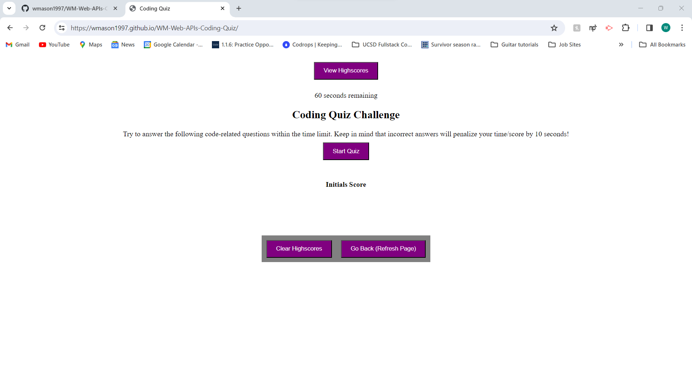
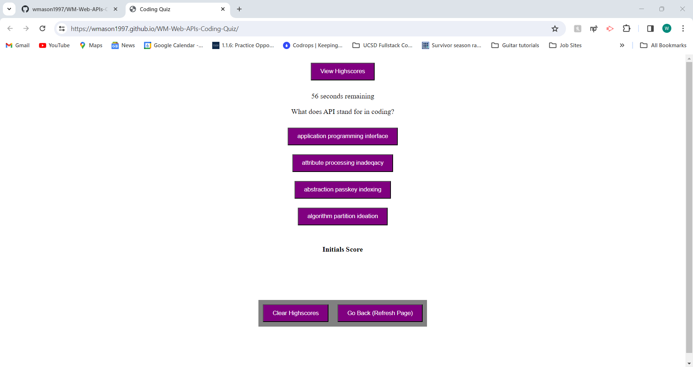
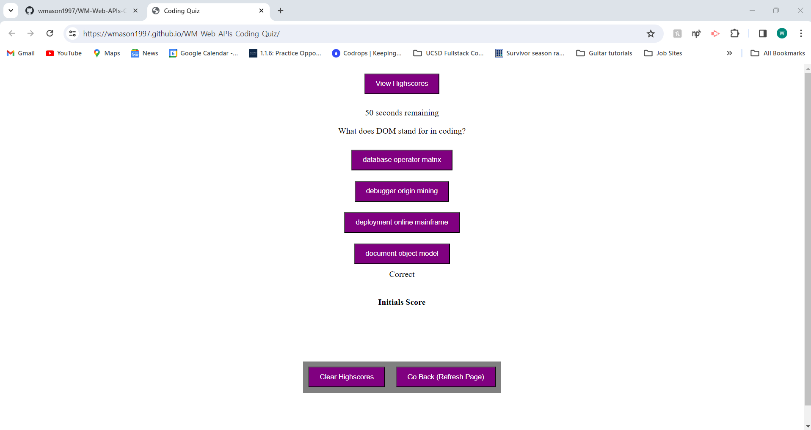
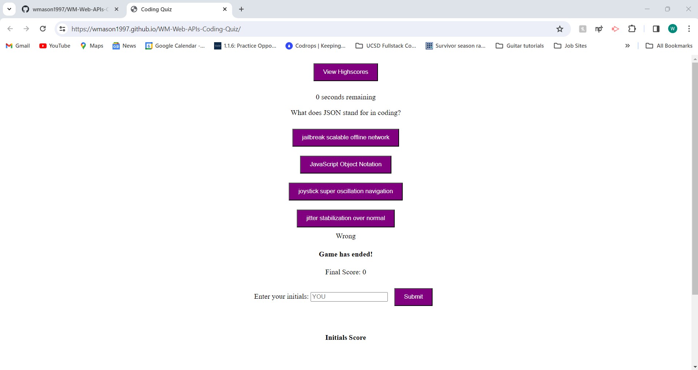
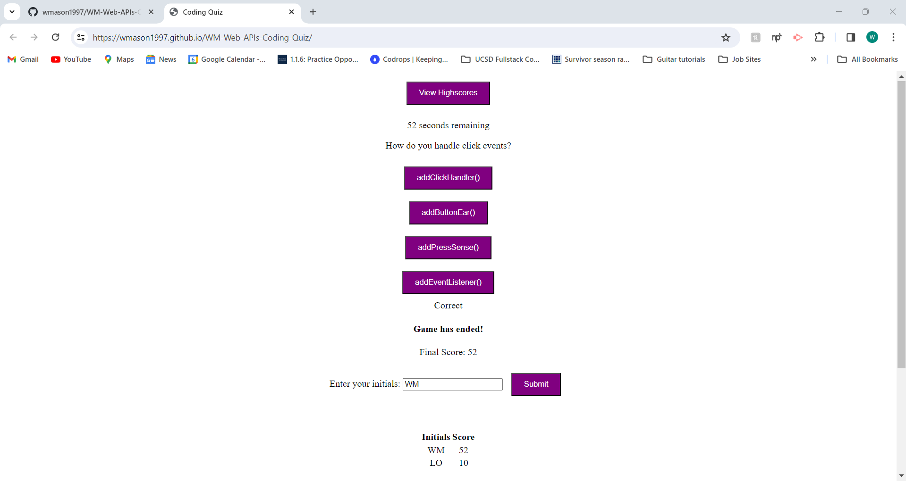

# WM-Web-APIs-Coding-Quiz

## Description ##
The project this week was to create a website that displayed a timed quiz of coding questions that we were to come up with. The project necessitated DOM manipulation, the use of localStorage and eventListeners/Handlers, and creating functions for certain aspects of the quiz's functionality.

This project was intended to give us some familiarity with timed coding quizzes that we may encounter in our future job searches. This project's scoring, as per the instructions, does not differentiate between an individual who simply ran out of time and an individual who took 10 seconds to answer all the questions but got each of the five of them wrong - that is to say, both individuals would score zero. What I am getting at here is that the tradeoff between speed and precision was not required to be finetuned, which is why it was not.

This was a very fun project. I enjoyed making up questions and the experience of putting these different concepts together.

## Credits ##
I modeled this Web APIs Coding Quiz project after the solved 28-Stu-Mini-Project in the 04-Web-APIs folder of UCSD-VIRT-FSF-PT-09-2023-U-LOLC GitLab repository.

I used ChatGPT for help to write the first version my displayQuestion() function, with making the options be clickable and basic recursion as the main functionalities then. I also used it for help to vertically stack and horizontally center my question answer choices as buttons upon resubmission.

I had a tutoring session with Sandra Smith on Saturday 10/28/2023. They helped me with hiding the game-end-button and highscores-display divs until when I wanted them to display as dictated by the JavaScript. We spent about 20 minutes on the 1 second discrepancy but moved on when we we realized we were not making progress and I had other questions. Sandra helped me begin setting up the localStorage functionality for the highscores. Sandra also emphasized and helped me to realize that you can concatenate any type of elements in HTML to serve your needs. An example is the div in the index file with id = game-end-button. Sandra also pointed out that instead of subtracting from a variable and reassigning to the initial variable, I should use operators like -= to streamline my code.

At a certain point, I realized I would have to order the highscores in descending order by score so I Googled it and consulted [https://www.w3schools.com/js/js_array_sort.asp](https://www.w3schools.com/js/js_array_sort.asp) and [https://developer.mozilla.org/en-US/docs/Web/JavaScript/Reference/Global_Objects/Array/sort](https://developer.mozilla.org/en-US/docs/Web/JavaScript/Reference/Global_Objects/Array/sort) to do that in my highscoresOrder() function.

I needed help displaying my highscores in a table so I Googled and found this helpful YouTube video [https://www.youtube.com/watch?app=desktop&v=eS-FVnhjvEQ&t=61](https://www.youtube.com/watch?app=desktop&v=eS-FVnhjvEQ&t=61). I modeled the displaying to HTML section of my highscoresOrder() function after the example.

Nirav helped me in office hours to fix a duplicate highscores displaying issue I was facing and he helped me to get my choice items to change color when I hovered over them. Thanks Nirav!

I needed to be able to reload the page for a "Go Back" button when viewing highscores so I Googled and found this Stack Overflow link that I modeled a button after: [https://stackoverflow.com/questions/29884654/button-that-refreshes-the-page-on-click](https://stackoverflow.com/questions/29884654/button-that-refreshes-the-page-on-click). I referenced [https://www.w3schools.com/css/css3_buttons.asp](https://www.w3schools.com/css/css3_buttons.asp) and [https://www.w3schools.com/css/css_selectors.asp#:~:text=The%20CSS%20id%20Selector&text=The%20id%20of%20an%20element,the%20id%20of%20the%20element.](https://www.w3schools.com/css/css_selectors.asp#:~:text=The%20CSS%20id%20Selector&text=The%20id%20of%20an%20element,the%20id%20of%20the%20element.) when working on styling the buttons.

EDIT: After my first submission, I wanted to correct some points brought up by Central Grader SK. Namely, my buttons for answer choices not being buttons and instead being li elements and the View Highscores button functionality. So, I made some edits to address these issues for resubmission. Thanks, SK!

## Screenshots ##

## Link to Deployed Application ##
[William Mason's Web APIs Coding Quiz](https://wmason1997.github.io/WM-Web-APIs-Coding-Quiz/)